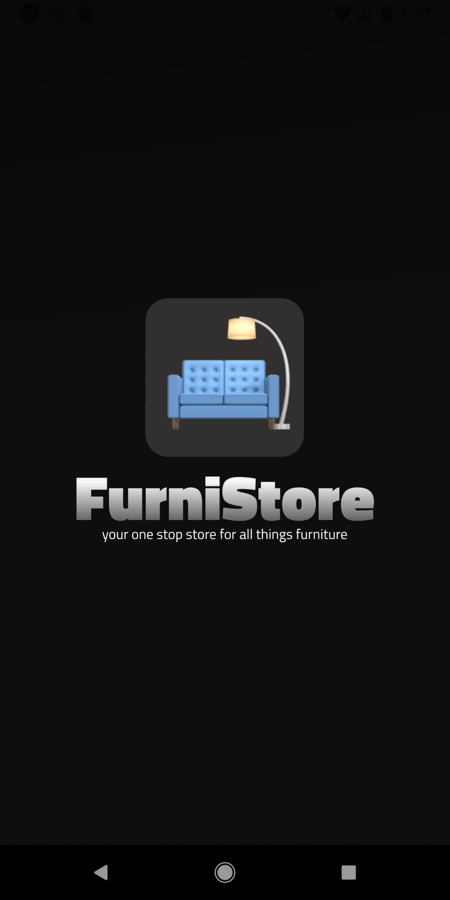
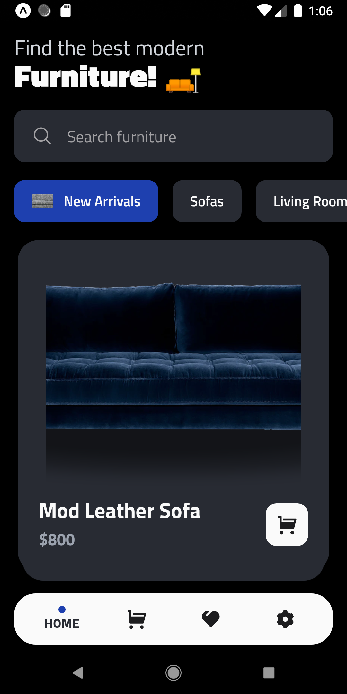
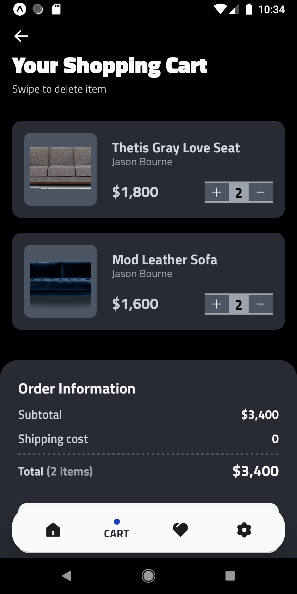
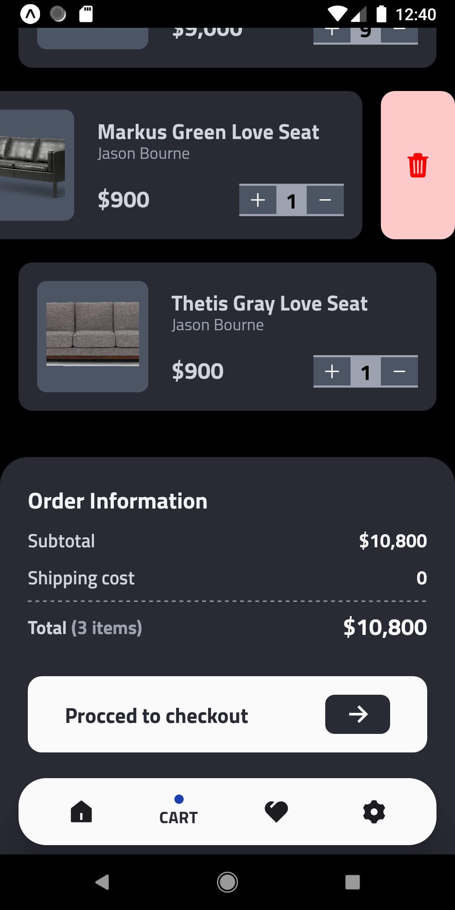

# **FurniStore**

FurniStore is an ecommerce store react native mobile application where you can buy modern furnitures.

 

 

### Features

- The user can see all the products divided by cateogries. The user has to swipe to see more products that a cateogry contains.
- The user can favourite (like) a product and see all liked product on favourites page.
- The user can add item to cart, increase the quantity of a product and checkout.
- The user can see the details of a product.

### Stack used

The app uses different libaries, languages, and tools to work properly. Main technologies:

- React Native
- Zustand
- TypeScript
- Expo
- Tailwind CSS (Nativewind)

## Installation

The FurniStore requires to [setup your development environment](https://reactnative.dev/docs/environment-setup) with react native to run.

Clone this repository and import into your preferred code editor.

For more information on how to run the app on a real device or an emulator after importing it, follow this [tutorial](https://reactnative.dev/docs/environment-setup).

**Any feedback is always welcome!**
